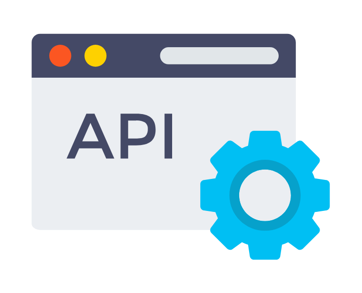

<!-- Improved compatibility of back to top link: See: https://github.com/othneildrew/Best-README-Template/pull/73 -->
<a name="readme-top"></a>
<!--
*** Thanks for checking out the Best-README-Template. If you have a suggestion
*** that would make this better, please fork the repo and create a pull request
*** or simply open an issue with the tag "enhancement".
*** Don't forget to give the project a star!
*** Thanks again! Now go create something AMAZING! :D
-->


<!-- PROJECT SHIELDS -->
<!--
*** I'm using markdown "reference style" links for readability.
*** Reference links are enclosed in brackets [ ] instead of parentheses ( ).
*** See the bottom of this document for the declaration of the reference variables
*** for contributors-url, forks-url, etc. This is an optional, concise syntax you may use.
*** https://www.markdownguide.org/basic-syntax/#reference-style-links
-->
[![Contributors][contributors-shield]][contributors-url]
[![Forks][forks-shield]][forks-url]
[![Stargazers][stars-shield]][stars-url]
[![Issues][issues-shield]][issues-url]
[![Apache-2.0 License][license-shield]][license-url]
[![LinkedIn][linkedin-shield]][linkedin-url]


<!-- PROJECT LOGO -->
<br />
<div align="center">
  <a href="https://github.com/OmerFarukAras/TSAPI">
    
  </a>

<h3 align="center">TS API</h3>

  <p align="center">
    the beginning of the api's I will write in all coding languages 
    <br />
    <a href="https://github.com/OmerFarukAras/TSAPI"><strong>Explore the docs »</strong></a>
    <br />
    <br />
    <a href="https://github.com/OmerFarukAras/TSAPI">View Demo</a>
    ·
    <a href="https://github.com/OmerFarukAras/TSAPI/issues">Report Bug</a>
    ·
    <a href="https://github.com/OmerFarukAras/TSAPI/issues">Request Feature</a>
  </p>
</div>


<!-- TABLE OF CONTENTS -->
<details>
  <summary>Table of Contents</summary>
  <ol>
    <li>
      <a href="#about-the-project">About The Project</a>
    </li>
    <li>
      <a href="#getting-started">Getting Started</a>
      <ul>
        <li><a href="#prerequisites">Prerequisites</a></li>
        <li><a href="#installation">Installation</a></li>
      </ul>
    </li>
    <li><a href="#usage">Usage</a></li>
    <li><a href="#roadmap">Roadmap</a></li>
    <li><a href="#contributing">Contributing</a></li>
    <li><a href="#license">License</a></li>
    <li><a href="#contact">Contact</a></li>
  </ol>
</details>


<!-- ABOUT THE PROJECT -->
## About The Project

[![Product Name Screen Shot][product-screenshot]](https://github.com/OmerFarukAras/TSAPI)
<p align="right">(<a href="#readme-top">back to top</a>)</p>

<!-- GETTING STARTED -->
## Getting Started

This is an example of how you may give instructions on setting up your project locally.
To get a local copy up and running follow these simple example steps.

### Prerequisites
*  [node](https://nodejs.org/dist/v19.6.1/node-v19.6.1-x64.msi)
* npm
  ```sh
  npm install npm@latest -g
  ```

### Installation

1. Clone the repo
   ```sh
   git clone https://github.com/OmerFarukAras/TSAPI.git
   ```
2. Install NPM packages
   ```sh
   npm install
   ```
3. Enter your configs in `config/default.json`
   ```json
    {
        "JWT_SECRET_KEY": "ELIXXRADES___ELXXRADESS",
        "MONGO_URL": "your_mongo_url",
        "EXPRESS_PORT": "3000",
        "SALT": 10
    }
   ```

<p align="right">(<a href="#readme-top">back to top</a>)</p>


<!-- USAGE EXAMPLES -->
## Usage

For directly build & start 
```shell
    npm run dev
```

For start dist/app.js
```shell
    npm run dev:start
```

_[Documentation](https://example.com) soon..._

<p align="right">(<a href="#readme-top">back to top</a>)</p>


<!-- ROADMAP -->
## Roadmap

- [ ] ~~Email service~~.
- [ ] API Without pages.
- [ ] profile page.
- [ ] email login.
- [ ] Forgot password.

See the [open issues](https://github.com/OmerFarukAras/TSAPI/issues) for a full list of proposed features (and known issues).

<p align="right">(<a href="#readme-top">back to top</a>)</p>


<!-- CONTRIBUTING -->
## Contributing

Contributions are what make the open source community such an amazing place to learn, inspire, and create. Any contributions you make are **greatly appreciated**.

If you have a suggestion that would make this better, please fork the repo and create a pull request. You can also simply open an issue with the tag "enhancement".
Don't forget to give the project a star! Thanks again!

1. Fork the Project
2. Create your Feature Branch (`git checkout -b feature/AmazingFeature`)
3. Commit your Changes (`git commit -m 'Add some AmazingFeature'`)
4. Push to the Branch (`git push origin feature/AmazingFeature`)
5. Open a Pull Request

<p align="right">(<a href="#readme-top">back to top</a>)</p>


<!-- LICENSE -->
## License

Distributed under the APACHE2 License. See `LICENSE` for more information.

<p align="right">(<a href="#readme-top">back to top</a>)</p>


<!-- CONTACT -->
## Contact

Ömer Faruk Aras - [@elixxrades](https://twitter.com/elixxrades) - elixxrades@icloud.com

Project Link: [https://github.com/OmerFarukAras/TSAPI](https://github.com/OmerFarukAras/TSAPI)

<p align="right">(<a href="#readme-top">back to top</a>)</p>

<!-- MARKDOWN LINKS & IMAGES -->
<!-- https://www.markdownguide.org/basic-syntax/#reference-style-links -->
[contributors-shield]: https://img.shields.io/github/contributors/OmerFarukAras/TSAPI.svg?style=for-the-badge
[contributors-url]: https://github.com/OmerFarukAras/TSAPI/graphs/contributors
[forks-shield]: https://img.shields.io/github/forks/OmerFarukAras/TSAPI.svg?style=for-the-badge
[forks-url]: https://github.com/OmerFarukAras/TSAPI/network/members
[stars-shield]: https://img.shields.io/github/stars/OmerFarukAras/TSAPI.svg?style=for-the-badge
[stars-url]: https://github.com/OmerFarukAras/TSAPI/stargazers
[issues-shield]: https://img.shields.io/github/issues/OmerFarukAras/TSAPI.svg?style=for-the-badge
[issues-url]: https://github.com/OmerFarukAras/TSAPI/issues
[license-shield]: https://img.shields.io/github/license/OmerFarukAras/TSAPI.svg?style=for-the-badge
[license-url]: https://github.com/OmerFarukAras/TSAPI/blob/master/LICENSE
[linkedin-shield]: https://img.shields.io/badge/-LinkedIn-black.svg?style=for-the-badge&logo=linkedin&colorB=555
[linkedin-url]: https://linkedin.com/in/ömer-faruk-aras-774994208
[product-screenshot]: public/8525225452fe.png